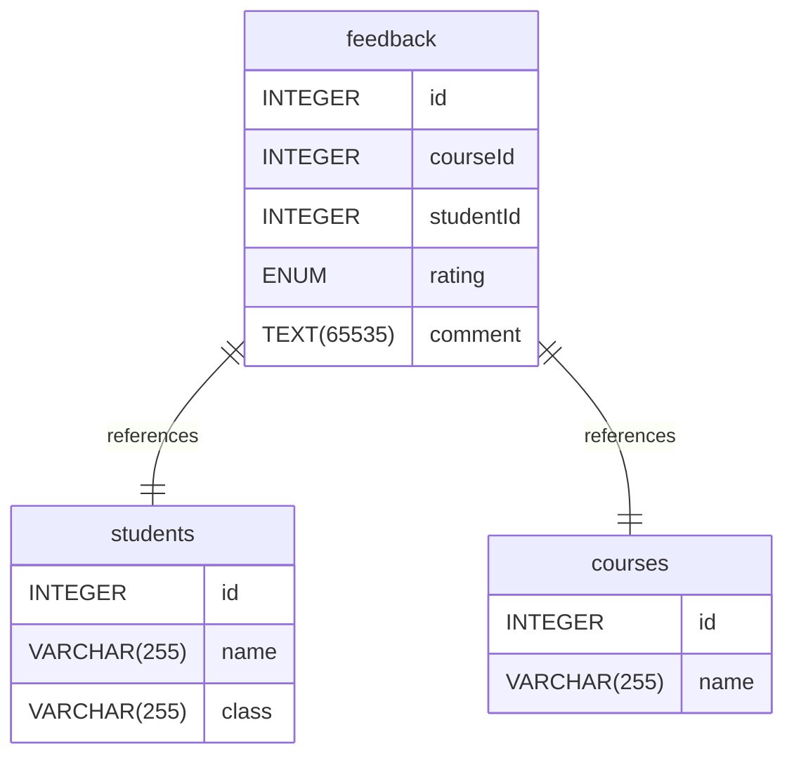

# Untitled Diagram documentation
## Summary

- [Introduction](#introduction)
- [Database Type](#database-type)
- [Table Structure](#table-structure)
	- [courses](#courses)
	- [feedback](#feedback)
	- [students](#students)
- [Relationships](#relationships)
- [Database Diagram](#database-Diagram)

## Introduction

## Database type

- **Database system:** MySQL
## Table structure

### courses

| Name        | Type          | Settings                      | References                    | Note                           |
|-------------|---------------|-------------------------------|-------------------------------|--------------------------------|
| **id** | INTEGER | 🔑 PK, not null , unique, autoincrement |  | |
| **name** | VARCHAR(255) | not null  |  | | 

### feedback

| Name        | Type          | Settings                      | References                    | Note                           |
|-------------|---------------|-------------------------------|-------------------------------|--------------------------------|
| **id** | INTEGER | 🔑 PK, not null , unique, autoincrement |  | |
| **courseId** | INTEGER | not null  | feedback_courseId_fk | |
| **studentId** | INTEGER | not null  | feedback_studentId_fk | |
| **rating** | ENUM | not null  |  | |
| **comment** | TEXT(65535) | not null  |  | | 

#### Enums
##### rating

- 1
- 2
- 3
- 4
- 5

### students

| Name        | Type          | Settings                      | References                    | Note                           |
|-------------|---------------|-------------------------------|-------------------------------|--------------------------------|
| **id** | INTEGER | 🔑 PK, not null , unique, autoincrement |  | |
| **name** | VARCHAR(255) | not null  |  | |
| **class** | VARCHAR(255) | not null  |  | | 

## Relationships

- **feedback to students**: one_to_one
- **feedback to courses**: one_to_one

## Database Diagram

